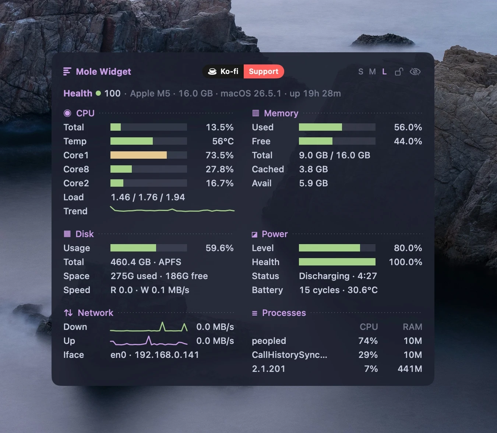

# Mole Widget

[](https://github.com/bsnkhua/mole-widget/actions/workflows/ci.yml)
[](https://github.com/bsnkhua/mole-widget/releases)
[](LICENSE)
[](https://github.com/jaywcjlove/awesome-mac)
[](https://ko-fi.com/bsnkhua)

**Mole Widget** is a lightweight macOS desktop system monitor widget: live CPU, memory, disk, network, battery and process metrics right on your desktop. Native Swift + SwiftUI in the terminal aesthetic of the `mo status` CLI (mole) — a borderless window living at desktop level, above the wallpaper and below application windows.




## Features

- **Header** — chip, RAM, macOS version, uptime and a composite health score (0–100)
- **CPU** — total usage, top-3 busiest cores, load average, usage trend sparkline
- **Memory** — used/free, total, cached, available
- **Disk** — root volume usage, used/free space, read/write speed
- **Power** — charge level, battery health, status, cycle count, temperature
- **Network** — download/upload sparklines with rates, active interface and local IP
- **Processes** — top-3 by CPU with memory footprint
- Click any section title to open Activity Monitor
- Visible on all Spaces, ignored by Mission Control and ⌘Tab, stays below regular windows
- Drag it anywhere with the mouse; position is remembered across launches
- Resizable: drag the right edge to adjust the width (490–880 pt), saved across launches
- 🔒 Clickable lock icon on the widget (plus a "Lock position" menu item) pins both position and size
- Settings in the menu bar: background opacity, visible sections, refresh rate (1/2/5 s)
- Launch at login toggle; no Dock icon

## Requirements

- macOS 14+
- Swift 6 toolchain — Command Line Tools are enough (`xcode-select --install`), full Xcode is not required

## Install

### Direct download

Download the latest `MoleWidget.dmg` from the [Releases page](https://github.com/bsnkhua/mole-widget/releases), open it, drag **Mole Widget** into Applications, and launch it from there.

The app is signed and notarized — Gatekeeper will not block it.

### Homebrew

```bash
brew install bsnkhua/tap/mole-widget
mole-widget   # launch the widget
```

The formula builds the widget from source on your machine (~30 s; needs only
the Command Line Tools that Homebrew already requires). Because the app is
built locally, Gatekeeper has no objections to the unsigned bundle.

Quit it any time from the menu bar icon → **Quit Mole Widget**.

### From source

```bash
make app
open "dist/Mole Widget.app"   # or move it to /Applications
```

## Update

If you installed the **DMG** into Applications, the widget keeps itself up to
date via [Sparkle](https://sparkle-project.org): it checks in the background and,
when a new signed release is available, offers to download and install it in
place. You can also check on demand from the menu bar icon → **Check for
Updates…**.

If you installed via **Homebrew**, update through brew instead:

```bash
brew update && brew upgrade mole-widget && (pkill -f "Mole Widget.app"; sleep 1; mole-widget)
```

(`brew update` first — third-party taps refresh only during a full update.
The trailing part restarts the widget: brew replaces the files on disk, but
the old version keeps running until relaunched.)

## Uninstall

1. Toggle off **Launch at login** in the menu bar (if you enabled it) and quit the widget
2. Remove the package:

```bash
brew uninstall mole-widget
```

3. Optional cleanup — remove the tap and the saved settings:

```bash
brew untap bsnkhua/tap
defaults delete com.sbezbabnykh.mole-widget
```

> Uninstalled while the widget was still running? The orphaned process keeps
> the widget on screen — quit it with:
>
> ```bash
> pkill -f "Mole Widget"
> ```

## Feedback

Found a bug or have an idea? [Open an issue](https://github.com/bsnkhua/mole-widget/issues) —
bug reports and feature requests are both welcome. The widget's menu bar icon also has a
**Report an Issue** shortcut.

## Development

```bash
make run    # run a dev build
make test   # run the test suite (80 tests)
```

> **Important:** run tests only via `make test`. On a machine without full Xcode
> a bare `swift test` silently runs zero tests and exits 0 — the Makefile passes
> the toolchain flags required for Swift Testing from Command Line Tools.

## Architecture

```
Sources/MoleWidgetCore/    — library
  CPU|Memory|Disk|Power/   — one module per domain: pure math + collector
  Store/MetricsStore.swift — @Observable store, 2/30/60 s timers
  Views/                   — SwiftUI, terminal theme
Sources/MoleWidget/        — app shell: desktop-level window, MenuBarExtra
```

All computation is pure functions over raw snapshots (unit-tested); collectors are thin wrappers around mach APIs / IOKit with smoke tests.
